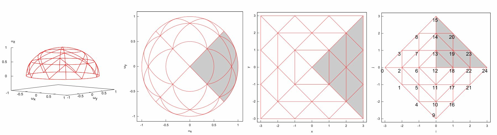
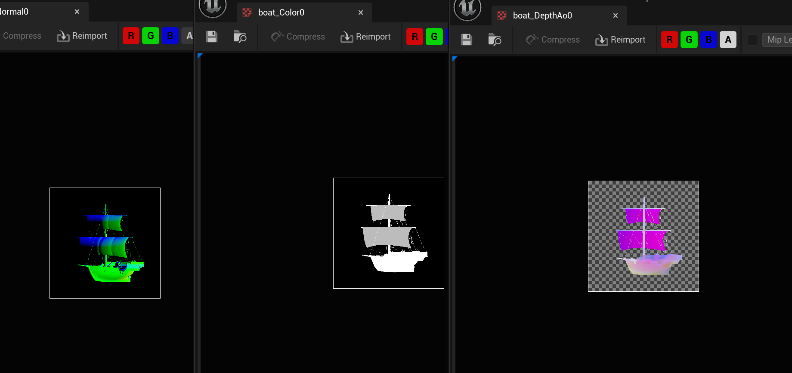
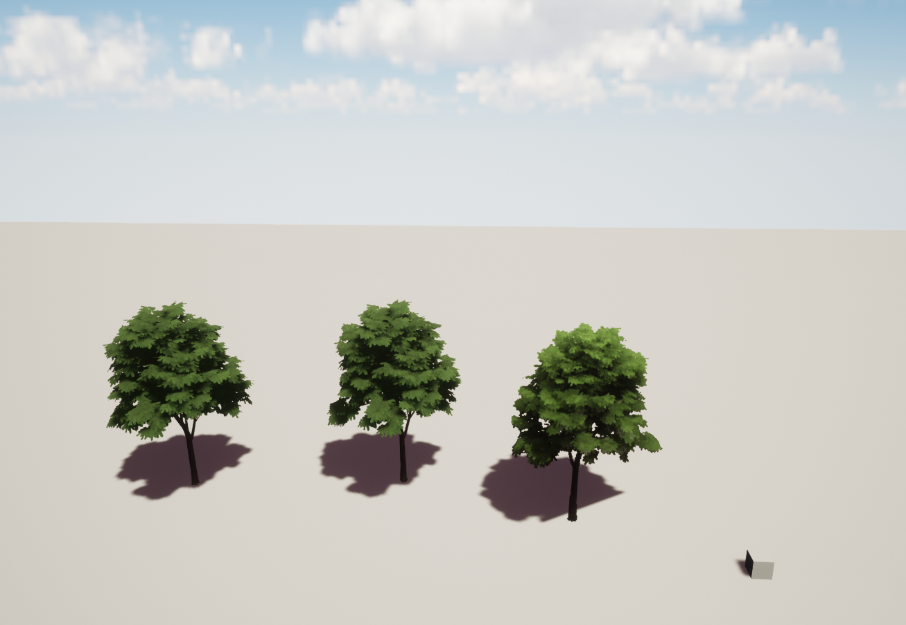
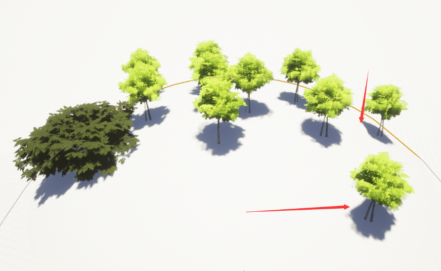

# 实现

实现论文Imposter树分两步走，其一是在离线烘焙必要的资源，其二是实现运行时渲染

# 离线烘焙

论文所述一个模型所需的运行时信息有Color、Normal、前向depth背向depth以及AO。不考虑法线压缩，简单将其分为3个TextureArray。第一个存Color、第二个存Normal、第三个存Depth及AO

1. 离线烘焙使用SceneCaptureComponent实现，背向depth通常来讲需要设置DepthStencilState为CF\_DepthFartherOrEqual。引擎改动上相对麻烦一点，一个比较取巧的方式是翻转View矩阵
   ```
   FMatrix CurrentMatrix = GetViewMatrix(viewIndex);
   FMatrix RotationMatrix = CurrentMatrix;
   FMatrix CameraAxisRotation;
   if (!isBack)
   {
   	CameraAxisRotation = FMatrix(
   		FPlane(0, 0, 1, 0),
   		FPlane(1, 0, 0, 0),
   		FPlane(0, 1, 0, 0),
   		FPlane(0, 0, 0, 1)
   	);
   }
   else
   {
   	//没机会设置FartherOrEqual 所以这里翻转坐标轴向
   	//CaptureComponent 不会通过FTransform把Scale传入，所以还得改引擎加CustomRotationMatrix直接覆盖。
   	CameraAxisRotation = FMatrix(
   		FPlane(0, 0, -1, 0),
   		FPlane(1, 0, 0, 0),
   		FPlane(0, 1, 0, 0),
   		FPlane(0, 0, 0, 1)
   	);}
   ```

那么需要扩展下USceneCaptureComponent2D 使其支持输入自定义矩阵。

```
void FScene::UpdateSceneCaptureContents(USceneCaptureComponent2D* CaptureComponent)
{
  FMatrix ViewRotationMatrix;
  if (CaptureComponent->bUseCustomRotationMatrix)
  {
  	ViewRotationMatrix = CaptureComponent->CustomRotationMatrix;
  }
  else
  {
  	ViewRotationMatrix = Transform.ToInverseMatrixWithScale();
  	// swap axis st. x=z,y=x,z=y (unreal coord space) so that z is up
  	ViewRotationMatrix = ViewRotationMatrix * FMatrix(
  		FPlane(0, 0, 1, 0),
  		FPlane(1, 0, 0, 0),
  		FPlane(0, 1, 0, 0),
  		FPlane(0, 0, 0, 1));
}

```

1. 离线烘焙点位的设置采用四面体投影，因为树木在地面，主要的视线方向是上半球因此没有使用八面体投影。



总计181个视角，生成逻辑也比较简单：

```
{
	int n = 9;
	for (int i = -n; i <= n; ++i)
	{
		for (int j = -n + abs(i); j <= n - abs(i); ++j)
		{
			float x = (i + j) / float(n);
			float y = (j - i) / float(n);

			float angle = 90.0 - FMath::Max(fabs(x), fabs(y))*90.0f;
			float alpha = (x == 0.0&&y == 0.0) ? 0.0 : FMath::Atan2(y, x) / PI * 180.0f;
			FMatrix rotationMatrix = RotateMatrixZ(alpha) * RotateMatrixY(-angle);
			// adjust
			rotationMatrix = rotationMatrix * RotateMatrixZ(180.0);
			matrixlist.Add(rotationMatrix);
		}
	}}
```

1. 每个View下的AO信息从Mesh树的VolumeAO中得来。VolumeAO生成的大致思路是将mesh按Bound分成128x128x128。每个cell在其位置的球面上发射8x32根射线。每个射线方向构建一个toView矩阵，在此空间下定义包围盒并创建临时体素网格。从后向前遍历采样点，确认采样点是否落在三角面上，如落在三角面上，则总数累计1。对cell而言，查询前一步每个射线的累计结果，如遮蔽数超过阈值就减去AO权重。
   ```
   #define Unreal_Space
   	float* ComputeAO(const int GRIDRES, int& ArrayLen,const UStaticMesh* Mesh)
   	{
   		check(Mesh)

   		FVector Extent = Mesh->GetRenderData()->Bounds.BoxExtent;
   		FVector Origin = Mesh->GetRenderData()->Bounds.Origin;

   		const FStaticMeshVertexBuffer* VertexBuffer = &(Mesh->GetRenderData()->LODResources[0].VertexBuffers.StaticMeshVertexBuffer);
   		const FRawStaticIndexBuffer* IndexBuffer = &(Mesh->GetRenderData()->LODResources[0].IndexBuffer);
   		const FPositionVertexBuffer* PositionVertexBuffer = PositionVertexBuffer = &(Mesh->GetRenderData()->LODResources[0].VertexBuffers.PositionVertexBuffer);

   #ifdef TestAOVolume
   		/*if (buf)
   			return buf;
   		else*/
   		delete[] buf;
   		buf = new float[GRIDRES*GRIDRES*GRIDRES * 4];
   #else
   		unsigned char* buf = new unsigned char[GRIDRES*GRIDRES*GRIDRES * 4];
   #endif

   		for (int i = 0; i < GRIDRES; ++i) {
   			for (int j = 0; j < GRIDRES; ++j) {
   				for (int k = 0; k < GRIDRES; ++k)
   				{
   					int offset = i + j * GRIDRES + k * GRIDRES*GRIDRES;
   					buf[4 * offset] = 0;
   					buf[4 * offset + 1] = 0;
   					buf[4 * offset + 2] = 0;
   					buf[4 * offset + 3] = 0;
   				}
   			}
   		}

   		ArrayLen = GRIDRES * GRIDRES*GRIDRES * 4;

   		check(PositionVertexBuffer);
   		check(VertexBuffer);
   		check(IndexBuffer);

   		TArray<uint32> Copyindex;
   		IndexBuffer->GetCopy(Copyindex);

   		int IndexNum = IndexBuffer->GetNumIndices();
   		for (int in = 0; in < IndexNum; in += 3)
   		{
   			int a = Copyindex[in];
   			int b = Copyindex[in + 1];
   			int c = Copyindex[in + 2];

   			FVector3f point1 = (PositionVertexBuffer->VertexPosition(a) - FVector3f(Origin)) / FVector3f(Extent);
   			FVector3f point2 = (PositionVertexBuffer->VertexPosition(b) - FVector3f(Origin)) / FVector3f(Extent);
   			FVector3f point3 = (PositionVertexBuffer->VertexPosition(c) - FVector3f(Origin)) / FVector3f(Extent);

   			point1 = (point1 + 1.0) / 2.0;
   			point2 = (point2 + 1.0) / 2.0;
   			point3 = (point3 + 1.0) / 2.0;

   			float x1 = point1.X;
   			float y1 = point1.Y;
   			float z1 = point1.Z;
   			float x2 = point2.X;
   			float y2 = point2.Y;
   			float z2 = point2.Z;
   			float x3 = point3.X;
   			float y3 = point3.Y;
   			float z3 = point3.Z;

   			float l12 = sqrt((x2 - x1)*(x2 - x1) + (y2 - y1)*(y2 - y1) + (z2 - z1)*(z2 - z1));
   			float l23 = sqrt((x3 - x2)*(x3 - x2) + (y3 - y2)*(y3 - y2) + (z3 - z2)*(z3 - z2));
   			float l31 = sqrt((x1 - x3)*(x1 - x3) + (y1 - y3)*(y1 - y3) + (z1 - z3)*(z1 - z3));

   			if (l12 > l23 && l12 > l31)
   			{
   				Swap(a, c);
   				Swap(x1, x3);
   				Swap(y1, y3);
   				Swap(z1, z3);
   				Swap(l12, l23);
   			}
   			else if (l31 > l12 && l31 > l23)
   			{
   				Swap(a, b);
   				Swap(x1, x2);
   				Swap(y1, y2);
   				Swap(z1, z2);
   				Swap(l31, l23);
   			}

   			int n12 = int(ceil(l12*GRIDRES)*2.0);
   			int n13 = int(ceil(l31*GRIDRES)*2.0);
   			for (int i = 0; i <= n12; ++i)
   			{
   				float u = float(i) / n12;
   				for (int j = 0; j <= n13; ++j)
   				{
   					float v = float(j) / n13;
   					if (u + v < 1.0)
   					{
   						float x = x1 + u * (x2 - x1) + v * (x3 - x1);
   						float y = y1 + u * (y2 - y1) + v * (y3 - y1);
   						float z = z1 + u * (z2 - z1) + v * (z3 - z1);
   						int ix = int(x*GRIDRES);
   						int iy = int(y*GRIDRES);
   						int iz = int(z*GRIDRES);

   						if (ix >= 0 && ix < GRIDRES&& iy >= 0 && iy < GRIDRES &&iz >= 0 && iz < GRIDRES)
   						{
   #ifdef Unreal_Space
   							int offset = 4 * (ix * GRIDRES*GRIDRES + iy * GRIDRES + iz);
   #else
   							int offset = 4 * (ix + iy * GRIDRES + iz * GRIDRES*GRIDRES);
   #endif					

   							buf[offset] = 255;
   							buf[offset + 1] = 255;
   							buf[offset + 2] = 255;
   							buf[offset + 3] = 255;
   						}
   					}
   				}
   			}
   		}

   		float* vocc = new float[GRIDRES*GRIDRES*GRIDRES];
   		for (int i = 0; i < GRIDRES*GRIDRES*GRIDRES; ++i)
   		{
   			vocc[i] = 1.0;
   		}

   		const int N = 8;
   		for (int i = 0; i < N; ++i)
   		{
   			float theta = (i + 0.5) / N * PI / 2.0;
   			float dtheta = 1.0 / N * PI / 2.0;
   			for (int j = 0; j < 4 * N; ++j)
   			{
   				float phi = (j + 0.5) / (4 * N)*2.0*PI;
   				float dphi = 1.0 / (4 * N)*2.0*PI;
   				float docc = cos(theta) *sin(theta)*dtheta*dphi / PI;

   				FVector uz = FVector(cos(phi)*sin(theta), sin(phi)* sin(theta), cos(theta));
   				FVector vNormal = FVector(-uz.Y, uz.X, 0.0);
   				vNormal.Normalize();
   				FVector ux = (uz.Z == 1.0) ? FVector(1.0, 0.0, 0.0) : vNormal;
   				FVector uy = FVector::CrossProduct(uz, ux);

   				FMatrix toView = FMatrix(FVector(ux.X, uy.X, uz.X)
   					, FVector(ux.Y, uy.Y, uz.Y)
   					, FVector(ux.Z, uy.Z, uz.Z)
   					, FVector(0.0, 0.0, 0.0));                            //no sure

   				FMatrix toVol = toView.GetTransposed();

   				FBox b = FBox(FVector(0.0, 0.0, 0.0), FVector(0.0, 0.0, 0.0));
   				//b = enLarge(b, toView*FVector(-1.0, -1.0, -1.0));
   				TreeUtils::enLarge(b, toView.TransformPosition(FVector(-1.0, -1.0, -1.0)));
   				TreeUtils::enLarge(b, toView.TransformPosition(FVector(1.0, -1.0, -1.0)));
   				TreeUtils::enLarge(b, toView.TransformPosition(FVector(-1.0, 1.0, -1.0)));
   				TreeUtils::enLarge(b, toView.TransformPosition(FVector(1.0, 1.0, -1.0)));
   				TreeUtils::enLarge(b, toView.TransformPosition(FVector(-1.0, -1.0, 1.0)));
   				TreeUtils::enLarge(b, toView.TransformPosition(FVector(1.0, -1.0, 1.0)));
   				TreeUtils::enLarge(b, toView.TransformPosition(FVector(-1.0, 1.0, 1.0)));
   				TreeUtils::enLarge(b, toView.TransformPosition(FVector(1.0, 1.0, 1.0)));

   				int nx = int((b.Max.X - b.Min.X)*GRIDRES / 2);
   				int ny = int((b.Max.Y - b.Min.Y)*GRIDRES / 2);
   				int nz = int((b.Max.Z - b.Min.Z)*GRIDRES / 2);

   				int* occ = new int[nx*ny*nz];
   				//int occ[nx*ny*nz];
   				for (int iocc = 0; iocc < nx*ny*nz; ++iocc)
   				{
   					occ[iocc] = 0;
   				}

   				for (int iz = nz - 1; iz >= 0; --iz)
   				{
   					float z = b.Min.Z + (iz + 0.5) / nz * (b.Max.Z - b.Min.Z);

   					for (int iy = 0; iy < ny; ++iy)
   					{
   						float y = b.Min.Y + (iy + 0.5) / ny * (b.Max.Y - b.Min.Y);

   						for (int ix = 0; ix < nx; ++ix)
   						{
   							float x = b.Min.X + (ix + 0.5) / nx * (b.Max.X - b.Min.X);

   							int val = 0;
   							FVector p = toVol.TransformVector(FVector(x, y, z));
   							int vx = int((p.X + 1.0) / 2.0*GRIDRES);
   							int vy = int((p.Y + 1.0) / 2.0*GRIDRES);
   							int vz = int((p.Z + 1.0) / 2.0*GRIDRES);

   							if (vx >= 0 && vx < GRIDRES&&vy >= 0 && vy < GRIDRES&&vz >= 0 && vz < GRIDRES)
   							{
   #ifdef Unreal_Space
   								val = buf[4 * (vx * GRIDRES*GRIDRES + vy * GRIDRES + vz) + 3] == 255 ? 1 : 0;
   #else
   								val = buf[4 * (vx + vy * GRIDRES + vz * GRIDRES*GRIDRES) + 3] == 255 ? 1 : 0;
   #endif

   							}
   							occ[ix + iy * nx + iz * nx*ny] = val;
   							if (iz != nz - 1)
   							{
   								occ[ix + iy * nx + iz * nx*ny] += occ[ix + iy * nx + (iz + 1)*nx*ny];
   							}
   						}
   					}
   				}

   				for (int igri = 0; igri < GRIDRES; ++igri)
   				{
   					float x = -1.0 + (igri + 0.5) / GRIDRES * 2.0;
   					for (int jgri = 0; jgri < GRIDRES; ++jgri)
   					{
   						float y = -1.0 + (jgri + 0.5) / GRIDRES * 2.0;
   						for (int k = 0; k < GRIDRES; ++k)
   						{
   							float z = -1.0 + (k + 0.5) / GRIDRES * 2.0;
   							FVector p = toView.TransformVector(FVector(x, y, z));
   							int vx = int((p.X - b.Min.X) / (b.Max.X - b.Min.X)*nx);
   							int vy = int((p.Y - b.Min.Y) / (b.Max.Y - b.Min.Y)*ny);
   							int vz = int((p.Z - b.Min.Z) / (b.Max.Z - b.Min.Z)*nz);

   							if (vx >= 0 && vx < nx && vy >= 0 && vy < ny&&vz >= 0 && vz < nz)
   							{
   								int n = occ[vx + vy * nx + vz * nx*ny];
   								if (n > 6)
   								{
   									vocc[igri + jgri * GRIDRES + k * GRIDRES*GRIDRES] -= docc;
   								}
   							}
   						}
   					}
   				}

   				delete[] occ;
   			}
   		}

   		for (int i = 0; i < GRIDRES; ++i)
   		{
   			for (int j = 0; j < GRIDRES; ++j)
   			{
   				for (int k = 0; k < GRIDRES; ++k)
   				{
   #ifdef Unreal_Space
   					int offsetSrc = i + j * GRIDRES + k * GRIDRES*GRIDRES;
   					int offsetDesc = i * GRIDRES*GRIDRES + j * GRIDRES + k;
   					if (buf[4 * offsetDesc + 3] == 255)
   					{
   						float v = FMath::Max(vocc[offsetSrc], 0.0f);
   						buf[4 * offsetDesc] = v;
   						buf[4 * offsetDesc + 1] = v;
   						buf[4 * offsetDesc + 2] = v;
   					}
   #else
   					int offset = i + j * GRIDRES + k * GRIDRES*GRIDRES;
   					if (buf[4 * offset + 3] == 255)
   					{
   						float v = FMath::Max(vocc[offset], 0.0f);
   						buf[4 * offset] = v;
   						buf[4 * offset + 1] = v;
   						buf[4 * offset + 2] = v;
   					}
   #endif			

   				}
   			}
   		}

   		return buf;	}
   ```

2. 采样VolumeAO时使用当前ViewMatrix将屏幕坐标转为VolumeUV。我这里用一个ComputeShader将两次DepthCapture的结果和AO采样的结果放到了一起。
   ```
   [numthreads(8,8,1)]
   void Main(uint3 DispatchThreadId : SV_DispatchThreadID)
   {
   	const uint2 uvCoord = DispatchThreadId;

   	float depthfront = DecodeFloatRGBA(DepthFront[uvCoord]);
   	float depthback = DecodeFloatRGBA(DepthBack[uvCoord]);
   	
   	depthfront = depthfront == 0 ? depthfront : 1.0f - depthfront;
   	depthback = (1.0f - depthback) == 0 ? 0.0f : depthback;
   	
   	float Width = 0.0f;
   	float Height = 0.0f;
   	DepthFront.GetDimensions(Width, Height);
   	float2 UV = (float2(uvCoord) + 0.5f) / float2(Width, Height);
   	
   	UV = 2 * UV - 1;
   	UV.y = -UV.y;
   	
   	float depth = depthfront;
   	float4 clipPos = float4(UV.x, UV.y, depth, 1);
   	
   	float4x4 clip2World = ScreenToWorld;
   	float4 worldPos = mul(clipPos, clip2World);
   	worldPos /= worldPos.w;
   	
   	Output[uvCoord] = float4(worldPos.x, worldPos.y, worldPos.z, 1);
   	float4x4 world2Local = float4x4(
   		1, 0, 0, 0,
   		0, 1, 0, 0,
   		0, 0, 1, 0,
   		0, 0, 0, 1
   	);
   	
   	float4 localPos = mul(worldPos, world2Local);
   	
   	float4 VolumeUV = (localPos + 1.0) / 2.0;
   	
   	float VW, VH, VD;
   	AOVolume.GetDimensions(VW, VH, VD);
   	
   	//float AO = AOVolume[uint3(VolumeUV.x * VW, VolumeUV.y*VH, VolumeUV.z*VD)].r;
   	float AO = AOVolume.SampleLevel(AOVolumeSampler, float3(VolumeUV.x, VolumeUV.y, VolumeUV.z), 0).r;
   	
   	float Epsilon = .0001f;
   	AO = depth < Epsilon ? 0.0f : AO;
   	
   	float Alpha = depth < Epsilon ? 0.0f : 1.0f;
   	
   	Output[uvCoord] = float4(depthfront, depthback, AO, Alpha);
   	//Output[uvCoord] = float4(localPos.x, localPos.y, localPos.z, 1);}
   ```


最终，一个视角下的预烘焙资源是这样的




# 运行时渲染

1. 由一个面片作为Imposter绘制一棵树。在VS阶段，需要决定
   * tDir 相机到顶点的向量
   * cDir local空间下Camera方向
   * lDir local空间下光照方向
   * TreeId 树种类
   * Treeposition 树位置
   等等


2. 自定义树的Bxdf，VolumeTreeShading相对标准模型，在Specular上加上了HotSpot和BeerFunction。这里利用两张Depth获取的光学深度Hack光在树表面及内部的衰减
   ```

   if (GBuffer.ShadingModelID == SHADINGMODELID_VOLUMETREE)   //cause our imposter tree's pixel dont have correct depth (depthoffset expensive) , have to hack here .
   {
   float HackShadow = exp(-10.0f * GBuffer.CustomData.w);
   Shadow.SurfaceShadow *= HackShadow;
   //hack here for transmissionlight. if we get accurate opacitydepth from different part of tree ,that would be better.
   float HackTransShadow = exp(-32.0f * GBuffer.CustomData.w);       //no where to store OD.				
   Shadow.TransmissionShadow *= HackTransShadow;    
   }
   ```

float VoL = dot(V, L);

float Scatter = D\_GGX(0.6 \* 0.6, saturate(-VoL));

Lighting.Specular = AreaLight.FalloffColor \* (Falloff \* NoL) \* VolumeTreeShading(GBuffer, L, V, N, cosJ, SpecularGGXpart);

Lighting.Transmission = AreaLight.FalloffColor \* (Falloff \* WrapNoL \* Scatter) \* SubsurfaceColor;


大约是这样




# 阴影修正

解决DirectionalLight在高天顶角场景下，阴影被裁切的错误表现。用面片渲染阴影的话，在阴影Pass需要适当调整面片

```
float cosZenith = dot(normalize(direction), float3(0, 0, -1));
float cosTree = dot(normalize(gDir + gUp), float3(0 ,0, 1));

#ifdef SHADOW_DEPTH_SHADER
if(cosZenith > cosTree)
{
    float HScaleForImposter = 0.5; 
    float L = abs(tSize.y / normalize(direction).z);
    float3 ImposterOffset = HScaleForImposter*L*normalize(direction);
				
    A = +gLeft - gDir ;
    B = -gLeft - gDir ;
    C = +gLeft + gDir;
    D = -gLeft + gDir;
			
   A = A+ImposterOffset;
   B = B+ImposterOffset;
   C = C+ImposterOffset;
   D = D+ImposterOffset;
				
    A*=TreeScale;
    B*=TreeScale;
    C*=TreeScale;
    D*=TreeScale;
}
else
{
    A = +gLeft - gDir - gUp;
    B = -gLeft - gDir - gUp;
    C = +gLeft + gDir + gUp;
    D = -gLeft + gDir + gUp;
}
#else
A = +gLeft - gDir - gUp;
B = -gLeft - gDir - gUp;
C = +gLeft + gDir + gUp;
D = -gLeft + gDir + gUp;
#endif


//Please Delete following code

#ifdef SHADOW_DEPTH_SHADER
A =A+gDir;
B =B+gDir;
C =C+gDir;
D =D+gDir;#endif
```



Before

After
